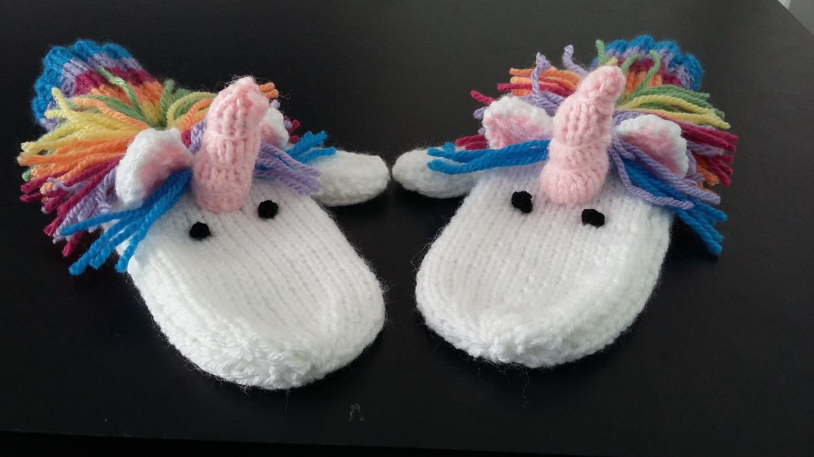
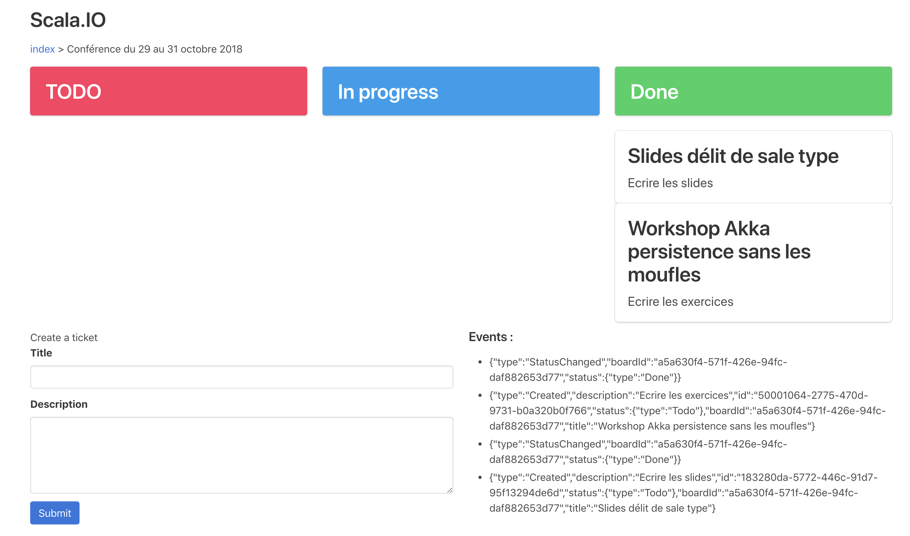

# Akka persistence sans les moufles

### Pré requis

* `sbt run` à la racine du projet  
* docker  + docker-compose installé + `docker-compose up`  à la racine du projet  
* Client PostGreSQL

Les tables nécessaires au workshop seront automatiquement créées lors du `docker-compose up`

Nous allons réaliser lors de ce workshop, un trello eventsourcé : 

[Workshop](1-workshop.md)
